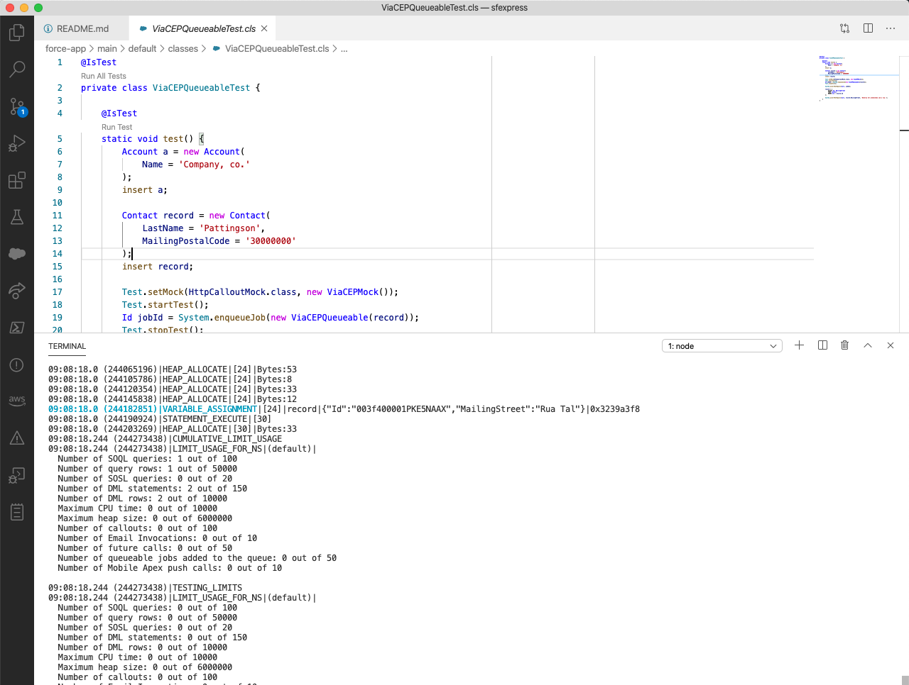

# Projeto Salesforce

Repositório de projeto Salesforce de exemplo para o Bootcamp Salesforce pelo IGTI com SysMap.

## Exemplo de método assíncrono anotado com @future

Na linha 7 da classe `AccountTriggerHandler` há uma chamada para o método assíncrono `getPostalCode` que está definido na linha 13 da mesma classe. Este método é anotado com `@future(callout=true)` e invoca um webservice público para consulta de informações de CEP.

## Exemplo de classe que implementa a interface Queueable

Na linha 10 da classe `ContactTriggerHandler` há uma invocação para enfileirar um serviço definido na classe `ViaCEPQueueable`. A classe recebe no construtor uma instância de um registro e atualiza este registro com as informações de CEP devolvidas pelo mesmo webservice do exemplo assíncrono com a anotação `@future`.

## Logs no terminal

Com a linha de comando da Salesforce (Salesforce CLI) instalada, podemos ter os mesmos logs do console do desenvolvedor da org no nosso terminal:

Basta usar o comando `sfdx force:apex:log:tail --color`. O terminal ficará inutilizável para novos comandos enquanto este não for cancelado, então é recomendado ter mais de uma instância aberta caso você esteja usando o terminal para interagir com uma organização.
